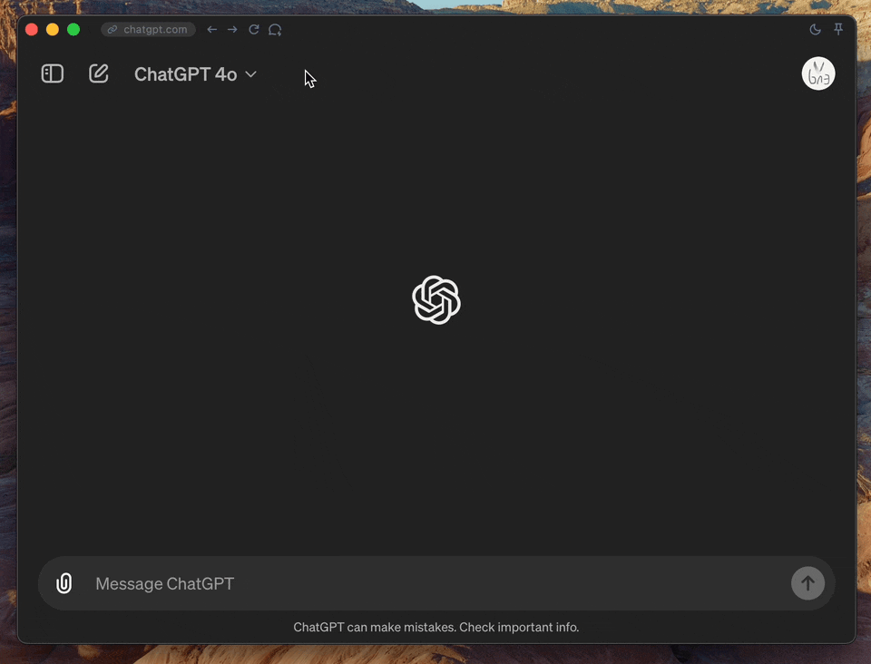

Thank you very much for your interest in this project. OpenAI has now released the macOS version of the application, and a Windows version will be available later ([Introducing GPT-4o and more tools to ChatGPT free users](https://openai.com/index/gpt-4o-and-more-tools-to-chatgpt-free/)). If you prefer the official application, you can stay updated with the latest information from OpenAI.

If you want to learn about or download the previous version (v1.1.0), please click [here](https://github.com/lencx/ChatGPT/tree/release-v1.1.0).

I am currently looking for some differentiating features to develop version 2.0. If you are interested in this, please stay tuned.

